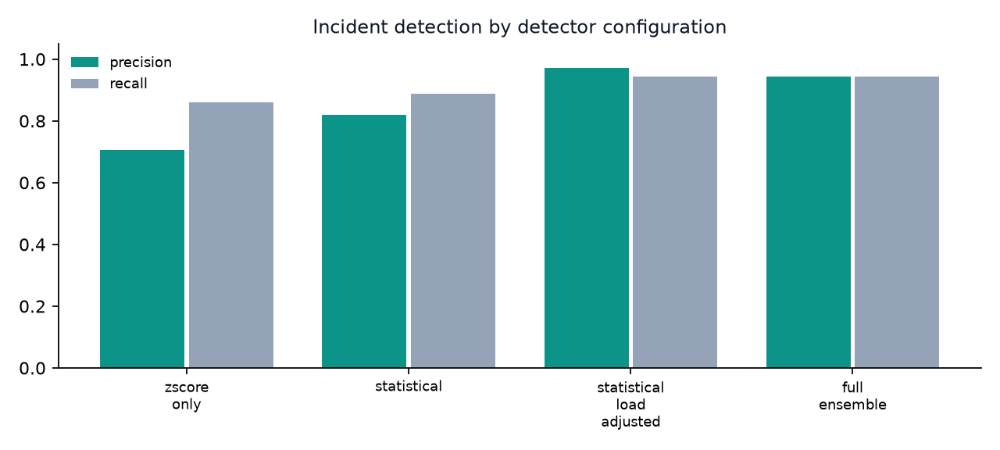
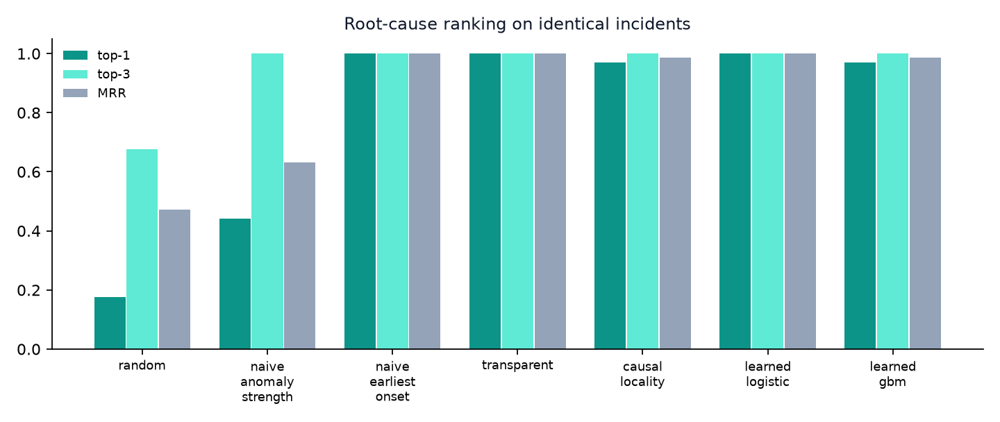

# IncidentDNA

**AI-powered production incident investigator.** It watches a distributed
application, notices when something breaks, works out *which service caused
it* rather than which service is complaining loudest, and shows the evidence.

```
Users see slow checkouts. The gateway is timing out, the order service's p95
is at 2.4s, and the database looks busy. Three services are on fire. Which one
do you page?

IncidentDNA answers in 30 seconds:

  Incident inc_00001
  Severity: High
  Started: 22:24:45 UTC

  Detected symptom: API Gateway request latency (p95) rose from 367 ms to 1.53 s
  Most likely root cause: PostgreSQL
  Confidence: 66%

  Evidence:
  1. PostgreSQL database query latency (p95) rose from 18 ms to 1.65 s.
  2. PostgreSQL own processing latency (p95) rose from 20 ms to 1.31 s.
  3. PostgreSQL became abnormal 15 s before Order Service, which calls it.
  4. 100% of PostgreSQL's added latency was its own work, not time spent
     waiting on dependencies.
  5. PostgreSQL held the largest share of request time in 47% of slow traces
     during the incident.
  6. The anomaly propagated PostgreSQL then Order Service then API Gateway.
```

That is verbatim output from this repository, not an illustration. The same
code produces the same verdict from the real Dockerised microservices —
`make replay` runs a recorded 7-minute session with a real injected database
fault and ranks PostgreSQL first.

---

## Try it in one command

```bash
make demo          # http://localhost:8000
```

No Docker, no Kafka, no database, no internet. Click **Inject fault**, pick
`database_latency`, and watch the graph turn red, an incident open, and
PostgreSQL get ranked with its evidence.

To reproduce every number in this README:

```bash
make pipeline      # dataset -> train -> evaluate, about 4 minutes
make results
```

To run the real distributed system instead of the simulated one:

```bash
make up            # Docker: 4 services + PostgreSQL + Redpanda + the dashboard
curl -XPOST localhost:8081/fault/database_latency \
     -H 'content-type: application/json' -d '{"severity":0.85}'
```

---

## Results

Measured on a held-out test split of **45 runs / 36 injected incidents** that
were never used to fit a detector or a ranker. Reproduce with `make pipeline`.

### Detection — is something wrong?

Alerts are matched to injected incidents as whole events, not as rows. Each
row adds one idea to the row above it.

| detector | precision | recall | F1 | median delay | false alerts/hour |
|---|---|---|---|---|---|
| rolling z-score only | 0.705 | 0.861 | 0.775 | 30 s | 1.11 |
| \+ static thresholds | 0.821 | 0.889 | 0.853 | 30 s | 0.60 |
| \+ **load adjustment** | **0.971** | **0.944** | **0.958** | 30 s | **0.09** |
| \+ Isolation Forest & autoencoder | 0.944 | 0.944 | 0.944 | 30 s | 0.17 |

**The load adjustment is the result that matters.** Latency and CPU rise
whenever traffic rises, purely from queueing, so a benign 2.6× load surge
looks exactly like a fault to a plain z-score. Discounting the part of each
deviation that a concurrent load rise explains cut false alerts from 1.11/hour
to 0.09/hour — a 12× reduction in pager noise — while *raising* recall.

**The learned detectors did not help.** Isolation Forest and the autoencoder,
fitted on 8,800 normal windows, were within one alert of the statistical
ensemble and slightly worse. On this data the deviations that matter are
univariate and the multivariate models add nothing but a training step. That
is a real finding and it is reported rather than buried; both configurations
ship, and the statistical one needs no training at all.

Recall by fault type: `cpu_saturation`, `payment_timeout`,
`connection_exhaustion` and `bad_deployment` at 1.00; `database_latency` and
`memory_leak` at 0.83. Memory leaks are the slowest to catch (60 s median)
because the signal is a *slope*, not a level.

### Diagnosis — which component caused it?

All rankers score identical incidents and identical candidate sets
(4.5 candidate services per incident on average).

| ranker | top-1 | top-3 | MRR |
|---|---|---|---|
| random | 0.176 | 0.676 | 0.471 |
| naive: rank by anomaly strength | 0.441 | 1.000 | 0.632 |
| naive: rank by earliest onset | 1.000 | 1.000 | 1.000 |
| transparent weighted score | 1.000 | 1.000 | 1.000 |
| causal-locality score | 0.971 | 1.000 | 0.985 |
| learned: logistic regression | 1.000 | 1.000 | 1.000 |
| learned: gradient boosting | 0.971 | 1.000 | 0.985 |

Two honest readings of this table:

**Ranking by anomaly strength is worse than useless — 0.441, against a 0.176
random floor but far below everything that uses the dependency graph.** This
is the central finding. When a dependency crosses a client timeout, its caller
pays `timeout × attempts` and starts returning 5xx, so *the symptom is louder
than the cause*. Blaming the sickest-looking service blames the gateway. The
simulator reproduces this on purpose, and
`tests/test_rca.py::test_naive_strength_ranking_picks_the_symptom` pins it.

**Root-cause ranking is saturated on this dataset, and the learned models earn
nothing.** Once onset ordering is available, it alone gets 1.000. The
transparent weighted baseline and a logistic regression match it; they do not
beat it. This is a property of the generated data — propagation lags are drawn
from a clean 10–45 s distribution, so onsets are almost always correctly
ordered — not evidence that the learned rankers are good. A real system with
noisier onsets, partial instrumentation and concurrent incidents would
separate these methods; this dataset cannot. The learned coefficients are at
least sensible, with `dependency_broke_first` (−2.27) the strongest signal and
`anomaly_strength` (+1.96) next.

### System performance

| metric | value |
|---|---|
| telemetry throughput | 110,000 events/s (single process) |
| service-windows/s | 876 |
| mean window → diagnosis | 5.7 ms |
| p95 window → diagnosis | 7.9 ms |
| real-time speed-up | 2,600× |




Both charts are regenerated by `make evaluate`; the full report lives in
[`experiments/results/report.md`](experiments/results/report.md).

---

## How it works

```
              ┌──────────────┐     ┌───────────────┐     ┌────────────┐
   users ───► │ API Gateway  │───► │ Order Service │───► │ PostgreSQL │
              └──────┬───────┘     └──┬─────────┬──┘     └────────────┘
                     │                │         │
                     └────────────────┼────►┌───▼──────────────┐
                                      │     │ Inventory Service │
                                      │     └───────────────────┘
                                      └────►┌───────────────────┐
                                            │  Payment Service  │
                                            └───────────────────┘
                     │
                     │  spans · metrics · logs · deployment events
                     ▼
        ┌────────────────────────────┐
        │  telemetry bus (Kafka)     │ ◄── fault injector + ground-truth labels
        └────────────┬───────────────┘
                     ▼
        ┌────────────────────────────┐   15s windows, per service:
        │  streaming feature builder │   traffic · reliability · latency ·
        └────────────┬───────────────┘   resources · logs · trace evidence
                     ▼
        ┌────────────────────────────┐   static thresholds · rolling z-score ·
        │  stage 1: anomaly scoring  │   Isolation Forest · autoencoder
        └────────────┬───────────────┘
                     ▼
        ┌────────────────────────────┐   onset order · self-vs-dependency
        │  stage 2: root-cause rank  │   latency · propagation consistency ·
        └────────────┬───────────────┘   trace attribution · deployments
                     ▼
        ┌────────────────────────────┐
        │  evidence → FastAPI → UI   │
        └────────────────────────────┘
```

### The telemetry bus is the seam

Two things produce telemetry, and they emit byte-identical records:

- **The Dockerised microservices** (`services/`) — four FastAPI services and
  PostgreSQL, instrumented with W3C `traceparent` propagation, publishing to
  Kafka.
- **The simulator** (`incidentdna/sim/`) — a generative model of the same
  system, used to build the labelled dataset and to drive `make demo`.

Everything downstream of the bus — features, detection, ranking, evidence, the
dashboard — is one implementation shared by both. So the offline evaluation
scores the same code that serves the browser, and a capture from the real
services can be pushed through the trained models:

```bash
make replay      # a real 7-minute run with a real injected DB fault
#   1. PostgreSQL           score=0.754 confidence=46%
#   2. API Gateway          score=0.520 confidence=16%
```

That capture in `experiments/captures/` was recorded from the actual services,
not the simulator.

### Stage one: anomaly detection

Detectors score one `(service, window)` and return a number in `[0, 1]`, so
they are blendable. All of them consume the *same* relative-change vector —
each watched metric as a robust median/MAD z-score plus a log-ratio against
that service's own recent baseline. Absolute values would make the Isolation
Forest flag traffic spikes; relative change makes it load-invariant.

| detector | needs labels | catches |
|---|---|---|
| static thresholds | no | outright breaches (5xx, pool at 99%) |
| rolling z-score | no | deviation from a service's own norm |
| Isolation Forest | normal windows | odd *combinations* of deviations |
| autoencoder (sklearn MLP) | normal windows | broken relationships between metrics |

Three details that do the real work:

- **Baselines exclude the window being judged**, so an ongoing anomaly cannot
  inflate its own baseline, and use median/MAD rather than mean/σ so a couple
  of already-bad windows in the lookback do not hide the next one.
- **Load adjustment**: `z_effective = max(0, z − 0.6 · z_load)` for
  latency and CPU only. Error rates, pool utilisation and memory slope are
  never discounted — those do not rise just because traffic did.
- **Debouncing**: a service is confirmed after 2 consecutive windows over
  threshold, and its onset is backdated to the first of them. Incidents group
  concurrent services and close after 6 quiet windows.

### Stage two: root-cause ranking

Every abnormal service becomes a candidate — **plus every direct dependency of
one, even if it stayed under the threshold**. A cause is often subtler than
its symptom: a database going from 9 ms to 120 ms may never trip an alert
while the checkout it blocks times out spectacularly. Widening the pool this
way is why candidate coverage is 1.000; the cost is 4.5 candidates instead of
2.6, which is exactly why the random floor is 0.176 rather than 0.516.

Each candidate gets 14 features. The ones that carry the signal:

| feature | why it separates cause from symptom |
|---|---|
| `early_onset` | a cause is abnormal before the things it breaks |
| `self_latency_share` | did *its own work* slow down, or is it just waiting? |
| `propagation_consistency` | the services that broke after it should be the ones that call it |
| `dependency_broke_first` | if its own dependency broke first, it is a symptom |
| `trace_attribution` | in slow traces, who actually holds the wall clock |
| `deployment_evidence` | a release immediately before its onset |

`self_latency_share` deserves the emphasis. Trace self-time is computed as a
server span's duration minus the time it spent in its own outbound calls, so a
2.4 s gateway span that waited 2.38 s on the order service credits ~20 ms to
the gateway and the rest downstream. It is the difference between "I am slow"
and "I am blocked".

Five rankers ship, all reading the same feature rows: two naive controls, the
design document's transparent weighted score, a hand-weighted causal-locality
score, and two learned models. You can switch between them live in the
dashboard and every incident is re-diagnosed.

### Evidence generation

Every sentence is generated from a stored measurement or event and names the
numbers it came from. If a measurement does not clear the bar for being
interesting, the sentence is simply not emitted — there is no template that
fires with a blank in it. Contradicting evidence is generated too, and shown:

> *Only 4% of API Gateway's added latency was its own work — the rest was
> spent waiting on a dependency.*

An LLM could rewrite the phrasing later. It must not be allowed to supply the
facts.

---

## How it was built, phase by phase

Each phase had to work and be measurable before the next one started. The
deliberate ordering choice was to build transparent statistical and graph
baselines *first*, so that any learned model later had something honest to
beat — and, as the results show, mostly did not.

### Phase 1 — Define the system before writing any of it

**Shipped:** [`incidentdna/topology.py`](incidentdna/topology.py),
[`incidentdna/telemetry/schema.py`](incidentdna/telemetry/schema.py)

The dependency graph and the telemetry wire format came first, because
everything else is defined on them. The graph is a validated DAG — edges point
from caller to callee, and a fault at a callee propagates *up* to its callers.
Inventory Service deliberately has two callers, so at least one node has
fan-in and propagation logic can't be written assuming a chain.

The schema fixed four record types — spans, metric points, log records,
deployment events. Four JSON Schemas are generated from the dataclasses
(`telemetry/schemas/`) so they cannot silently drift.

**Why it mattered:** this made the telemetry bus a hard interface. Anything
that emits these four records can drive the entire system, which is what later
allowed a simulator and a real Docker stack to share one analysis pipeline.

### Phase 2 — Build the application and instrument it

**Shipped:** [`services/`](services/) — API Gateway, Order Service, Payment
Service, Inventory Service, plus PostgreSQL

Four real FastAPI services running a checkout workflow: check inventory,
authorise payment, persist the order. Business logic is kept trivial on
purpose; the point is observable interaction.

Instrumentation follows how production observability actually splits: exact
counters for request and error counts, **sampled** duration exemplars for
latency percentiles, gauges for resources, head-sampled traces with W3C
`traceparent` propagation.

PostgreSQL can't run our agent, so its telemetry comes from client-side
instrumentation in the order service, attributed to `postgres` — each query
emits a client span on the caller *and* a server span credited to the
database. That is what later lets trace evidence blame the database for the
wall clock it actually held.

### Phase 3 — Make it break on demand, with known ground truth

**Shipped:** [`incidentdna/sim/faults.py`](incidentdna/sim/faults.py),
[`services/common/faults.py`](services/common/faults.py)

Six fault types, each implemented **twice** — once in the simulator, once for
real inside the services — sharing the same ramp profile so an injected fault
looks the same in both deployments. The real ones genuinely misbehave: a sleep
inside the query path, a semaphore standing in for a smaller pool, a list that
is never emptied until the process OOMs, a busy loop on a worker thread.

**The critical constraint:** the fault catalogue only ever declares the
*origin*. Which services end up affected, in what order, and how strongly is
emergent from the graph. The simulator never writes down a propagation path,
so the ranker cannot be scored against its own assumptions.

### Phase 4 — Generate a labelled dataset that isn't too easy

**Shipped:** [`incidentdna/sim/engine.py`](incidentdna/sim/engine.py),
[`incidentdna/sim/runs.py`](incidentdna/sim/runs.py)

166 independent 24-minute runs, 79,680 window rows, built in ~20 seconds. The
generative engine models three things that make root-cause analysis hard:

1. **Propagation with lag** — a caller observes its callee's degradation
   delayed by a per-edge 10–45 s lag, so onsets are ordered but noisy.
2. **Amplification** — once a dependency crosses a client timeout, the caller
   pays `timeout × attempts` and starts erroring, so *the symptom is often
   louder than the cause*.
3. **Confounders** — benign 1.6–2.6× traffic surges and deployments unrelated
   to any fault, in every run.

The confounders are the whole point. Without them the detector's job is
trivial and its precision is fiction.

**A correction made here:** services were initially provisioned to run at ~42%
utilisation, which meant a benign 2.4× surge genuinely saturated them. The
detector was right to fire and the *label* was wrong. Rather than teach it to
ignore real degradation, the modelled system was reprovisioned with the
headroom a real one carries.

### Phase 5 — Turn raw telemetry into window features

**Shipped:** [`incidentdna/pipeline/`](incidentdna/pipeline/)

A streaming feature builder reduces records into 22 features per service per
15-second window — traffic, reliability, latency percentiles, resources, log
counts, trace attribution. It is written as an online operator
(`ingest` / `pop_ready`), so the same object works over a replayed file, an
in-memory bus or a Kafka consumer, and porting the aggregation to Flink later
is a matter of re-expressing the same reductions.

Two details that earn their place: baselines are median/MAD rather than
mean/σ, and they **exclude the window being judged**, so an ongoing anomaly
can't inflate its own baseline.

### Phase 6 — Stage one: is something wrong?

**Shipped:** [`incidentdna/detect/`](incidentdna/detect/)

Four detectors — static thresholds, rolling z-score, Isolation Forest, and an
autoencoder — all scoring one `(service, window)` onto the same 0–1 scale so
they blend. All of them consume a *relative-change* vector rather than
absolute values; feeding absolute numbers to the Isolation Forest makes it
flag traffic spikes, which are not incidents.

**The finding that mattered:** latency and CPU rise whenever traffic rises,
purely from queueing. Discounting the part of each deviation that a concurrent
load rise explains — `z_eff = max(0, z − 0.6·z_load)`, applied to latency and
CPU only — took precision from 0.705 to 0.971 and cut false alerts 12×.

**The finding that was disappointing and is reported anyway:** the two learned
detectors, fitted on 8,800 normal windows, did not beat the statistical
ensemble.

### Phase 7 — Stage two: which component caused it, and why

**Shipped:** [`incidentdna/rca/`](incidentdna/rca/),
[`incidentdna/incidents/`](incidentdna/incidents/)

Per-window scores are debounced into incidents, then every abnormal service —
plus every direct dependency of one, even if it stayed quiet — becomes a
candidate with 14 features. Seven rankers were built and compared on identical
candidate sets: a random floor, two naive controls, two hand-weighted
transparent scorers, and two learned models.

The single most useful feature is `self_latency_share`: of the latency a
service gained, how much was its *own* work versus time spent waiting. Trace
self-time makes this computable — a 2.4 s gateway span that waited 2.38 s on a
downstream call credits ~20 ms to the gateway. It is the difference between
"I am slow" and "I am blocked".

Evidence generation is template-based and every sentence is derived from a
stored measurement. If a measurement doesn't clear the bar for being
interesting, the sentence is simply not emitted. Contradicting evidence is
generated and shown too.

**A bug caught by widening the candidate pool:** the hand-tuned
causal-locality scorer started rewarding idle leaf dependencies, which score
well on locality features precisely because they have no dependencies to
blame. Fixed by gating locality evidence on actual deviation — a quiet service
is not a cause.

### Phase 8 — Measure it honestly, then build the UI

**Shipped:** [`incidentdna/eval/`](incidentdna/eval/),
[`scripts/`](scripts/), [`backend/`](backend/), [`frontend/`](frontend/)

Detection and diagnosis are evaluated separately and at incident level, not
row level. Splits are by whole run and stratified by fault type; detection
runs once and is ranker-independent, so every ranker is scored on identical
incidents. All the leakage controls are listed under
[Dataset and labelling](#leakage-control).

Only then the dashboard: a FastAPI service and a dependency-free front end
with hand-drawn SVG charts — no build step, no CDN, works offline.

### Phase 9 — Verify the two paths actually agree

**Shipped:** [`scripts/replay.py`](scripts/replay.py),
[`tests/`](tests/) (115 tests)

The last phase was proving the Docker path and the simulated path produce the
same verdicts. The four real services were run, driven with load, given a real
injected database fault, and their captured telemetry replayed through the
models trained on simulated data — PostgreSQL ranked first. That recording
ships in `experiments/captures/` and `make replay` reproduces it.

The test suite runs the real microservices in-process, so the container path
is covered by CI rather than only by `docker compose up`.

---

## Supported failure types

| fault | injected by | propagation |
|---|---|---|
| `database_latency` | statement delay / dropped index | DB latency → order latency → gateway latency → timeouts |
| `connection_exhaustion` | pool shrunk under steady traffic | pool saturation → wait time → DB duration → request timeout |
| `memory_leak` | objects retained per request | memory growth → GC pressure → latency → OOM restart → errors |
| `payment_timeout` | delayed/dropped payment responses | payment timeouts → retries → checkout latency and failures |
| `cpu_saturation` | busy loop on a worker thread | CPU rises → workers stall → latency and queue growth |
| `bad_deployment` | release that fails for some inputs | version change → error-rate step change in that service |

Each is implemented **twice**, once in the simulator and once for real in
`services/common/faults.py`, with the same ramp profile so an injected fault
looks the same in both deployments.

---

## Dataset and labelling

`make dataset` produces 166 independent 24-minute experiment runs — 79,680
window rows — in about 20 seconds:

- 34 runs with no injected fault
- 22 runs per fault type × 6 fault types
- three traffic levels, three application versions, severities in [0.35, 1.0]
- randomised incident start times and origins
- **confounders in every run**: 0–2 benign traffic spikes of 1.6–2.6×, and
  0–2 deployments unrelated to any fault

The confounders are the point. Without them the detector's job is trivial and
its precision is a fiction. Deployment events unrelated to the incident are
what stop `deployment_evidence` from being a free win.

Only the *origin* is labelled. Which services end up affected, in what order,
and how strongly is emergent from the dependency graph — the simulator never
writes down a propagation path, so the ranker cannot be scored against its own
assumptions.

### Leakage control

- **Splits are by whole run, never by row.** Windows inside one incident are
  strongly correlated; splitting rows at random would leak the incident's own
  pattern into the test set.
- **Splits are stratified by fault type**, so each split has a proportional
  mix. Splitting globally left some fault types with one test run, which made
  per-fault recall unreadable.
- The unsupervised detectors see only windows from **normal train runs**, so
  "normal" never contains an incident.
- The learned rankers see only candidate rows from **train** incidents.
- Detection runs **once** per run and is ranker-independent, so every ranker is
  scored on identical incidents and identical candidates.
- Every number above comes from the test split.

---

## Repository layout

```
incidentdna/
├── incidentdna/              the library — one implementation, both paths
│   ├── topology.py           the service dependency graph
│   ├── telemetry/            wire schema + bus (memory / file / Kafka)
│   ├── pipeline/             feature builder, feature store, analyzer
│   ├── detect/               4 detectors + the ensemble
│   ├── rca/                  candidates, scorers, learned rankers, evidence
│   ├── incidents/            incident lifecycle and data model
│   ├── sim/                  fault catalogue, generative engine, experiments
│   └── eval/                 detection / diagnosis metrics, replay harness
├── services/                 the real microservices (Docker path)
├── backend/                  FastAPI incident service + live system
├── frontend/                 dashboard (no build step, no CDN)
├── scripts/                  generate_dataset · train · evaluate · replay
├── telemetry/                OTel collector, Prometheus, JSON schemas
├── tests/                    115 tests
└── docker-compose.yml
```

Data collection, features, models and evaluation are deliberately separate,
and nothing important lives in a notebook.

---

## The dashboard

Five views, answering the five questions an on-call engineer has:

| view | question |
|---|---|
| system overview | what is broken right now? |
| incident timeline | in what order did it happen? |
| metric comparison | how did it propagate? |
| trace evidence | show me one real slow request |
| model explanation | why did the ranker pick that, and what argues against it? |

Plus a live evaluation tab that reads `experiments/results/report.json`.

It is plain HTML, CSS and JavaScript with hand-drawn SVG charts — no build
step, no `node_modules`, no CDN, and it works offline.

---

## Testing

```bash
make test          # 115 tests, ~30s
```

The suite covers the graph, trace maths, feature reduction, baseline
correctness, detector behaviour (including that load adjustment suppresses a
spike but not a fault), the RCA features, the evaluation metrics themselves,
the HTTP API, and the six fault types end to end. It also runs the **real
microservices in-process** — real handlers, real instrumentation, real fault
controller — so the container path is covered by CI and not only by
`docker compose up`.

---

## Known limitations

These are the things I would fix next, in order.

1. **Root-cause ranking is saturated at 1.000 on this dataset, so it cannot
   distinguish the methods.** Onset ordering alone solves it. The generated
   propagation lags are too clean. A more honest benchmark needs noisier and
   partially-missing onsets, and overlapping incidents.
2. **One incident at a time.** The manager groups all concurrent anomalies into
   a single incident. Two unrelated faults in the same window would be merged
   and the ranker would be asked an ill-posed question.
3. **The learned models earn nothing here.** Both the ML detectors and the
   learned rankers match but do not beat untrained baselines. They are kept
   because the comparison is the point, not because they are load-bearing.
4. **The offline dataset is simulated.** The real services are verified end to
   end and one real capture is replayed in the repo, but the 166-run matrix
   comes from the generative model. Real runs at that scale would take 66
   hours of wall clock.
5. **No temporal model.** Detection is per-window with rolling baselines. The
   guide's LSTM/TCN/transformer direction is untouched — it should only be
   attempted once there is a dataset where the current detector actually fails.
6. **PostgreSQL telemetry is client-side.** Query latency and pool metrics are
   attributed to `postgres` by instrumentation in the order service, not by an
   agent inside the database. That is normal for managed databases, but it
   means a fault invisible to clients is invisible to IncidentDNA.
7. **Kafka has no recovery testing.** The bus works; broker restart and
   consumer-lag behaviour are not verified.

## What I would build next

- Overlapping incidents, and an incident-splitting step before ranking.
- Flink for the window aggregation (the feature builder is already written as
  an online operator, so the reductions port directly).
- A counterfactual check: re-score an incident with a candidate's telemetry
  removed, and see whether the story still holds.
- MLflow for the experiment matrix, which is currently just JSON.
- Kubernetes plus Chaos Mesh instead of Compose plus custom fault endpoints.

---

## Configuration

| variable | default | meaning |
|---|---|---|
| `INCIDENTDNA_SOURCE` | `simulated` | `simulated` or `kafka` |
| `INCIDENTDNA_SPEED` | `10` | simulated windows per real window |
| `INCIDENTDNA_SEED` | `7` | simulator seed |
| `INCIDENTDNA_CAPTURE` | — | tee all telemetry to a JSONL file |
| `KAFKA_BOOTSTRAP_SERVERS` | — | broker, for the Docker path |
| `DATABASE_URL` | — | PostgreSQL DSN for the order service |
| `TRACE_SAMPLE_RATE` | `0.25` | head-sampling rate for traces |

Detection thresholds, RCA weights and the feature list live in
`incidentdna/config.py`.
